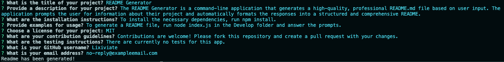

# C9-Node-JS

## Project Description

This project aims to dynamically create a professional README.md file using Node.js.

## Features

- Command-line application
- Prompts user for project details
- Generates a professional README.md file

## Usage

1. To install the necessary dependencies, run `npm install`
2. To generate a README file, run `node index.js`
3. Answer the prompts

## Example

## Source Code

- Base code provided by: [The Coding Bootcamp](https://github.com/coding-boot-camp/potential-enigma)
- Modifications by [Lixiviate](https://github.com/Lixiviate)
- Code assistance from:
  - [MDN Web Docs](https://developer.mozilla.org/en-US/)
  - [W3Schools](https://www.w3schools.com/)
  - [edX Xpert Learning Assistant](https://www.edx.org/)

## License

This project is licensed under the MIT license.
